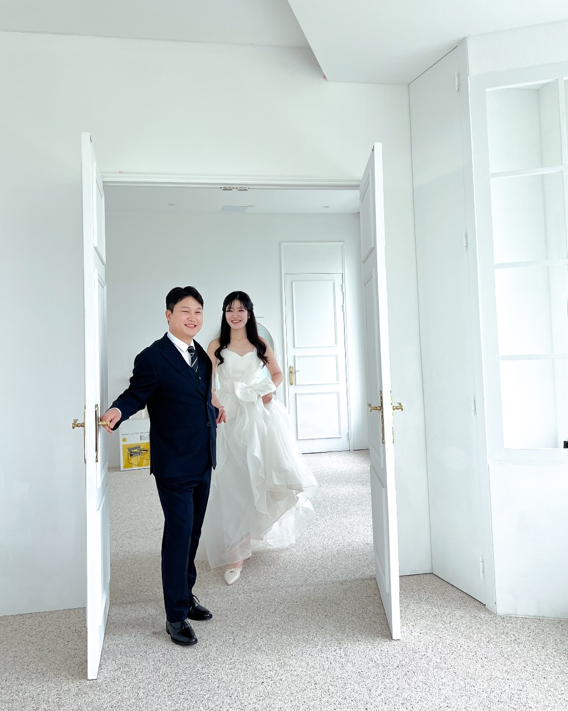
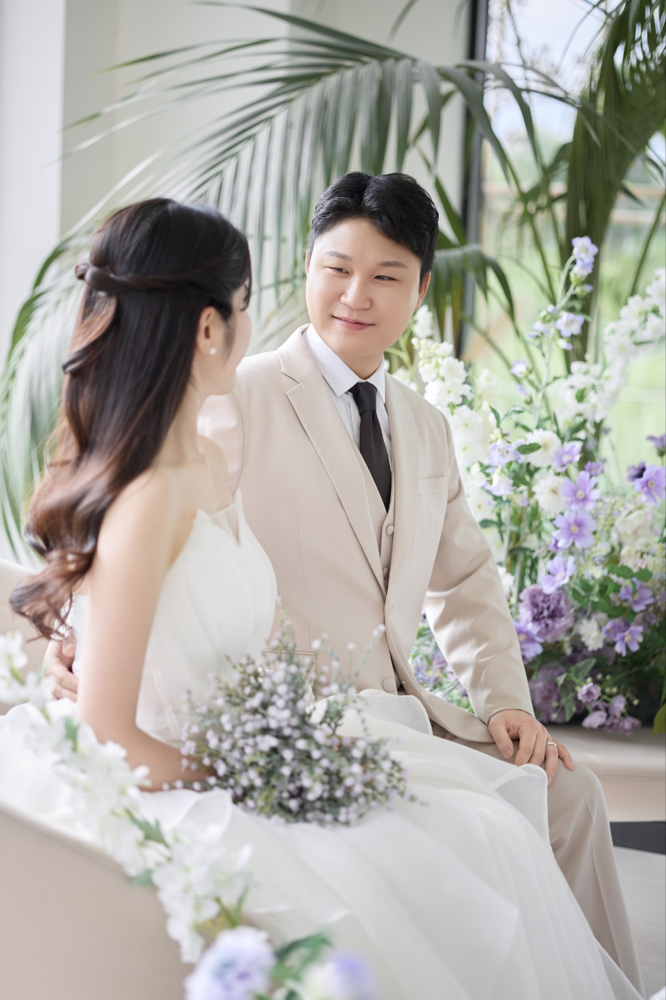

<!DOCTYPE html>
<html lang="ko">
<head>
  <meta charset="UTF-8" />
  <meta name="viewport" content="width=device-width, initial-scale=1" />
  <title>우리 결혼합니다</title>
  
</head>
<body>
  <header>
    <h1>우리는 결혼합니다</h1>
    <h2>소중한 당신을 초대합니다</h2>
  </header>

  <!-- 슬라이드 영역 -->
  

    
    
    
    
    
    
    
    
  

  

    <button id="prevBtn" aria-label="이전 사진 보기">← 이전</button>
    <button id="nextBtn" aria-label="다음 사진 보기">다음 →</button>
  

  

    서로의 삶이 하나로 이어지는 뜻깊은 날, 
    사랑과 믿음으로 함께 걸어가기로 약속했습니다.  
    두 사람이 만나 가족이 되는 이 기쁜 날, 
    따뜻한 마음으로 축복해 주시면 더없는 기쁨이겠습니다.
  

  

    2025년 10월 26일 일요일 오후 2시 30분 
    충주 파라다이스 웨딩홀 드레스가든
  

  

    신랑 계좌번호 : 신한은행 110-442-634305 
    신랑 전화번호 : 010-5360-1111  
    신부 계좌번호 : 
    신부 전화번호 : 010-2691-0852
  

  

    <h3>방명록</h3>
    <input type="text" id="guestName" placeholder="이름을 입력해주세요" />
    <textarea id="guestMessage" placeholder="따뜻한 한마디를 남겨주세요..."></textarea>
    <button onclick="saveMessage()">남기기</button>
    

  

  
</body>
</html>
